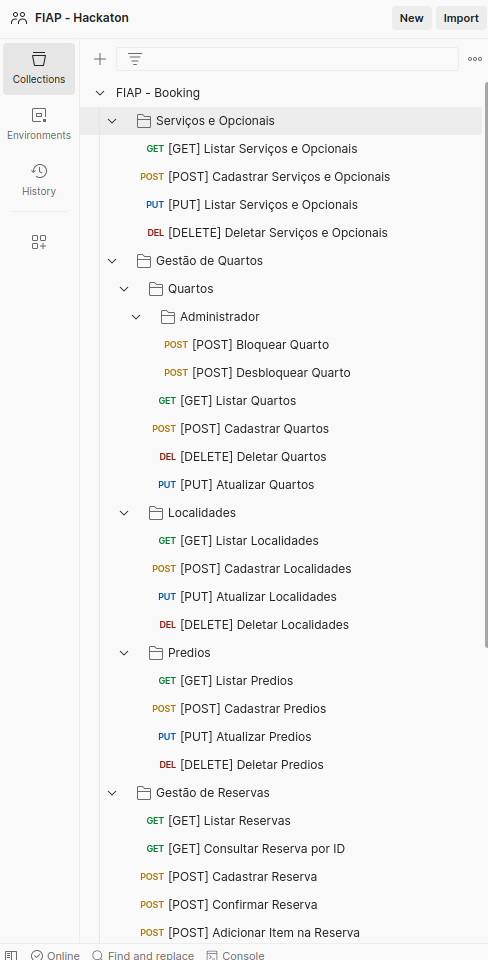

# HACKATHON FIAP - BOOKING

Este projeto é um sistema de gestão de hospitalidade, especificamente um sistema de reservas para hotéis. Ele permite aos usuários agendar, buscar a melhor solução custo-benefício e pré-reservar serviços e opções.

## Features

O sistema é composto por várias APIs:

- 👤**API Clientes**: Gerencia os dados do cliente.
```shell
curl --location 'http://localhost:8080/booking/api/clientes' \
--header 'Content-Type: application/json' \
--data-raw '{
    "nomeCompleto":"Jack Sparrow",
    "dataNascimento": "2023-04-12",
    "cpf": "48464167040",
    "sexo": "MASCULINO",
    "email": "jackzinho_matadordedragao@gmail.com",
    "telefone": "(11) 1234-1234",
    "paisDeOrigem": "Brasil",
    "endereco": "Rua dos alfineiros, 61"
}'
```
- 📒**API Localidade**: Gerencia os dados de localização.
```shell
curl --location 'http://localhost:8080/booking/api/localidades'
```
- 🏨**API Prédio**: Gerencia os dados do prédio.
```shell
curl --location 'http://localhost:8080/booking/api/predios' \
--header 'Content-Type: application/json' \
--data '{
    "nome":"Localidade 2",
    "localidadeId": 1
}'
```
- 😴**API Quarto**: Gerencia os dados do quarto.
```shell
curl --location 'http://localhost:8080/booking/api/quartos'
```
- 📅**API Reserva**: Gerencia os dados de reserva.
```shell
curl --location 'http://localhost:8080/booking/api/reservas' \
--header 'Content-Type: application/json' \
--data '{
  "clienteId": 1,
  "dataEntrada": "2023-05-01",
  "dataSaida": "2023-05-05",
  "quartosIds": [1, 2],
  "servicosOpcionais": ["Jantar","Café da manhã"]
}'
```
- 🍴**API Serviço Opcional**: Gerencia os dados de serviços opcionais.
```shell
curl --location 'http://localhost:8080/booking/api/servicos-opcionais'
```
- 🪒 **API Administrativa de bloqueio/desbloqueio de quartos**: Gerencia os dados de reserva de um quarto administrativamente
```shell
curl --location --request POST 'http://localhost:8080/booking/api/quartos/2/admin/bloquear'
curl --location --request POST 'http://localhost:8080/booking/api/quartos/2/admin/bloquear'
```
Importante: para consultar todas as opções de APIs, favor acessar a collection POSTMAN disponibilizada: [FIAP - Booking.postman_collection.json](src%2Fmain%2Fresources%2FFIAP%20-%20Booking.postman_collection.json)



## Tecnologias e ferramentas utilizadas:

* [Spring initializr]( https://start.spring.io/): Ferramenta para criação de projetos Spring Boot
* [Spring Boot ]( https://spring.io/projects/spring-boot): Framework Web 
* [Spring Boot Starter Web] Dependência para desenvolvimento Web
* [Spring Boot Starter Validation] Dependência para validação de formulários
* [Maven]( https://mvnrepository.com/): Gerenciador de dependências do projeto
* [JPA Repository] Gerenciador de interação entre camadas do projeto
* [Lombock] Dependência para requisições HTTP
* [Postman](https://www.postman.com/): Ferramenta para teste de requisições HTTP
* [Open Api - Swagger] Dependência para gerar interface amigável para testes
* [H2] Banco de dados em memória

## Dificuldades encontradas:

## Desafios

Optamos por trabalhar em monolito para criação da nossa aplicação e assim ganhar tempo para desenvolver outras camadas que compõe o projeto;

Optamos por atingir metade da cobertura dos testes para representar o conhecimento adquirido até o momento e seguimos para a próxima etapa do projeto; 

Durante o desenvolvimento do projeto encontramos alguns problemas de interpretação na regra de negócio, tais como, quais seriam os limites de desenvolvimento para este novo desafio: 
* Iria utilizar banco de dados? R: H2
* Qual seria a forma de fazer as simulações de requisições HTTP das API’s? R: swagger-ui / postman (criação de testes automatizados) <br>

Estes foram alguns dos levantamentos feitos pela equipe e a partir deles, começamos a estudar as melhores ferramentas para desenvolver as API’s. E como mencionado nas tecnologias e ferramentas utilizadas focamos nelas em específicos durante o projeto.
A partir desse ponto, realizamos algumas reuniões de alinhamento e planejamento do que seria feito e como seria. 


## Pontos chaves do projeto:

Durante as reuniões do projeto, definimos algumas informações básicas que as APIs precisariam para atender aos requisitos do projeto. Mapeamos da seguinte forma:
- **API Clientes**: ID, nomeCompleto, dataNascimento, CPF, passaporte, paisDeOrigem, endereco, email, telefone, sexo.
- **API Localidade**: ID, nome, amenidades, endereco, cep, numero, complemento, bairro, cidade, estado, predios.
- **API Prédio**: ID, nome, localidade, quartos.
- **API Quarto**: ID, tipo, totalPessoas, totalCamas, outrosMoveis, valorDiaria, predio, reservas.
- **API Reserva**: ID, cliente, dataEntrada, dataSaida, totalPessoas, quartos, valorTotal, status.
- **API Serviço Opcional**: ID, nome, valor, tipo (serviço ou item).

## Método de utilização da(s) API(s):

Para demonstração de utilização da(s) API(s) será utilizado o Swagger pela sua interface mais amigável, porém dentro do projeto foi gerado um arquivo de importação Jason do Postman que pode ser utilizado colocando as mesmas informações apresentadas no Swagger.
* [Swagger](http://localhost:8080/booking/swagger-ui/index.html#/) /): Servidor local para teste requisições HTTP (Browser);
* [Arquivo para teste Postman](https://warped-meteor-302132.postman.co/workspace/App-Consumo-Eletro~60891746-3429-418a-9499-910f095c31d9/collection/27681645-57d87472-1132-46fc-8916-268f42ac6cce?action=share&creator=27681645 ): Arquivo para simulação direto na máquina (PC).

## Consultando a Documentação da API
Você pode consultar a documentação da API utilizando o Swagger. Para isso, siga os passos abaixo:

Certifique-se de que a aplicação está em execução.
Abra um navegador web e navegue até http://localhost:8080/booking/swagger-ui.html.
Isso abrirá a interface do Swagger, onde você poderá explorar todos os endpoints disponíveis, seus parâmetros e respostas.

## Arquivo do Postman
Para facilitar o teste e a utilização da API, disponibilizamos um arquivo do Postman com todas as requisições pré-configuradas. Você pode encontrar o arquivo em:

```shell
./fiap-hackathon-booking/src/main/resources/FIAP - Booking.postman_collection.json
```

Basta importar esse arquivo para o seu ambiente do Postman e começar a usar as requisições imediatamente.


## Diagrama de tabelas:


